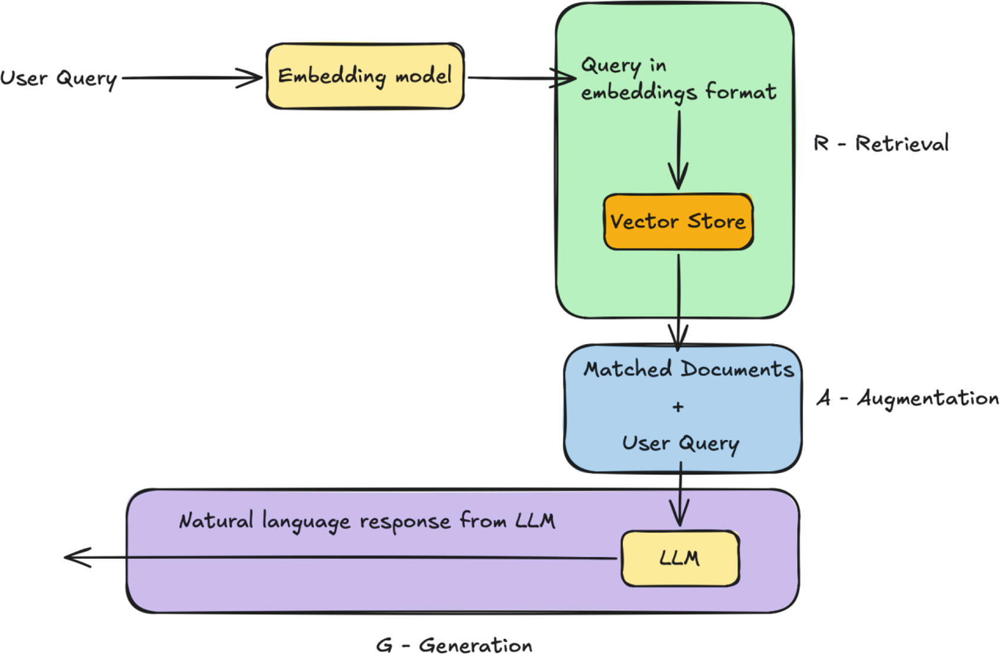

From Chatty to Clever: Retrieval-Augmented Generation (Chapter 7) — Summary

This chapter upgrades the TravelX chatbot from “general and guessy” to context-aware and accurate by introducing RAG (Retrieval-Augmented Generation) with LangChain4j. The goal is to answer organization-specific questions using internal data (files/PDFs/systems), instead of relying purely on the LLM’s training.

1) The problem: general LLMs don’t know your company’s truth

Without internal context, the model can:

- be outdated (training cutoff)

- hallucinate company-specific facts (e.g., inventing flight details)

- return “plausible” but wrong structured data

The chapter demonstrates this with a fake flight request (AABB101) that returns fabricated flight info—even in JSON form.

2) First mitigation: prompt + “unknown” handling

They strengthen the earlier “known facts only” prompt by introducing a shared defaultMessage (e.g., “Sorry, I am not aware of this context…”).

Then they add a guard in the service layer:

- Call the LLM

- If the response equals the default “I don’t know” message:

  - skip extraction 
  - return an empty Flight/Aircraft object (null fields)

- Otherwise:

    - run the FlightExtractor/AircraftExtractor to parse structured output

This reduces hallucination when the model admits uncertainty—but it still doesn’t solve the core issue: the model lacks your proprietary data.

3) The core solution: RAG (Retrieve → Augment → Generate)

RAG is introduced as the cost-effective alternative to:

- training a model from scratch

- fine-tuning a foundation model

RAG workflow:

1. Retrieve relevant internal info for the question (via semantic search)

2. Augment the prompt with that retrieved context

3. Generate the final answer using the LLM

Key constraint explained: context length (token budget)
You can’t stuff “all company knowledge” into every prompt—too big, too slow, and often irrelevant. RAG solves this by only injecting the few relevant chunks.

4) Embeddings + Vector Store (the “retrieval engine”)

The chapter explains:

- Embeddings: transform text into numeric vectors where distance ≈ semantic similarity

- Vector store: database/structure to store embeddings and perform fast similarity search

It contrasts vector search with keyword search (synonyms/phrasing differences), and names typical vector DB options (open-source and managed), emphasizing that RAG makes retrieval scale.

5) RAG in the TravelX app (LangChain4j “easy RAG”)

Implementation is kept simple using LangChain4j’s Easy RAG module:

- Add dependency: langchain4j-easy-rag

- Store proprietary flight data in a local file (flight-details.txt, CSV-like) in resources

- Load documents from the resources folder

- Ingest them into an InMemoryEmbeddingStore<TextSegment>

- Wire the assistant with a contentRetriever built from the embedding store

Effect:

- Asking for a real flight in the internal file (e.g., AA4041) now returns the correct flight record (and structured JSON via the existing extractor pipeline), because the assistant retrieves the matching row and feeds it as context.

## Key Takeaways

- Prompting alone can reduce hallucinations but can’t invent real company knowledge.

- RAG adds grounding: your answers come from your documents, not model guesses.

- The practical bottleneck is token budget → retrieval lets you inject only what matters.

- In LangChain4j, “easy RAG” gets you a working pipeline quickly using:

    - document loading → embedding ingestion → embedding store → content retriever → assistant

Next chapter shifts to Spring AI integration.